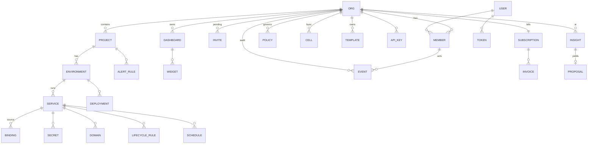

# Data models

## ERD (mermaid)

## Core tables (constraints & indexes)
- **orgs**(id, slug UNIQUE, name, home_region, plan enum, created_at) — slug immutable.
- **members**(org_id, user_id, role enum, PK(org_id,user_id)); ≥1 owner enforced by trigger.
- **invites**(id, org_id, email, role, status enum, expires_at, inviter_id) — UNIQUE(org_id,email) WHERE status='pending'; idx expires_at.
- **projects**(id, org_id, name UNIQUE(org_id,name)); **environments**(id, project_id, name, region_override).
- **services**(id, env_id, name UNIQUE(env_id,name), product enum, status enum, shape jsonb, monthly_estimate numeric) — idx (env_id,status).
- **bindings**(id, source_id, target_type enum, target_id nullable, provider nullable, provider_config jsonb nullable, secret_ref nullable, scope enum, status) — internal target (target_id) OR external provider (provider+secret_ref) per A5.5; UNIQUE(source,target_id) where internal; FK ON DELETE RESTRICT (delete goes through typed-confirm listing dependents). Storage/AI Bindings are external — credentials in Secrets, never proxied.
- **templates**(id, org_id, name, visibility enum, version int, source jsonb, contents jsonb, required_inputs jsonb) — contents NEVER contain secrets (checked at write).
- **dashboards**(id, org_id, scope jsonb {org|project_id}, visibility enum, layout jsonb, owner_id); **widgets**(id, dash_id, source enum, query, viz enum, pos jsonb).
- **tokens**(id, user_id, name, scope enum, hash, prefix, expires_at) — plaintext never stored.
- **subscriptions**(org_id PK, plan, anchor_day, status enum, trial_ends_at); **invoices**(id, org_id, period, lines jsonb, total, status).
- **quota_usage**(org_id, meter enum, period, used) — idx (org_id,period).
- **policies**(id, org_id, project_id NULL, key, enforcement enum, config jsonb).
- **events**(id, org_id, actor, via enum(user,assistant,system), action, subject, at) — append-only; idx (org_id,at desc).
- **insights**(id, org_id, service_id, severity, status enum, evidence jsonb); **proposals**(id, insight_id NULL, evidence jsonb, change jsonb, impact jsonb, status, applied_by NULL).

## Enums
role: owner|admin|developer|billing · plan: free|pro|business|enterprise · **product: postgres|valkey|web|worker** (managed services only, ADR-0004/A5; queue→pgmq Postgres capability, storage/ai→external Bindings, gpu removed) · service_status: provisioning|ready|degraded|failed|suspended|deleting (the spec §1.2 status vocabulary — `ready`, not `running`: metering starts at ready) · binding_scope: read_only|read_write · **binding_target_type: service|storage|ai** (external-provider Bindings per A5.5) · visibility: personal|org|restricted · dashboard_scope: org|project · quota_type: soft|hard · policy_enforcement: enabled|opt_in|disabled · invite_status: pending|accepted|declined|expired|revoked · insight_status: open|applied|dismissed|snoozed · dunning: current|grace|provisioning_paused|suspended
